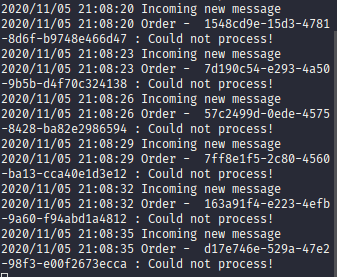
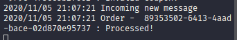
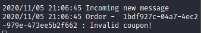
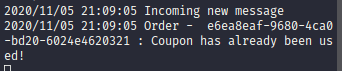

<h1 align="center">AvançaDev</h1>

Este repositório contém os desafios feitos durante o workshop AvançaDev

 

<h2 align="center">Aula 2 - Comunicação e filas com RabbitMQ</h2>

 

<h3 align="center">Caso 1 - Serviço C fora do ar</h3>

 

<h3 align="center">Caso 2 - Aprovado</h3>

 

<h3 align="center">Caso 3 - Cupom inválido</h3>

 

<h3 align="center">Caso 4 (BÔNUS) - Cupom já foi utilizado pelo usuário</h3>

